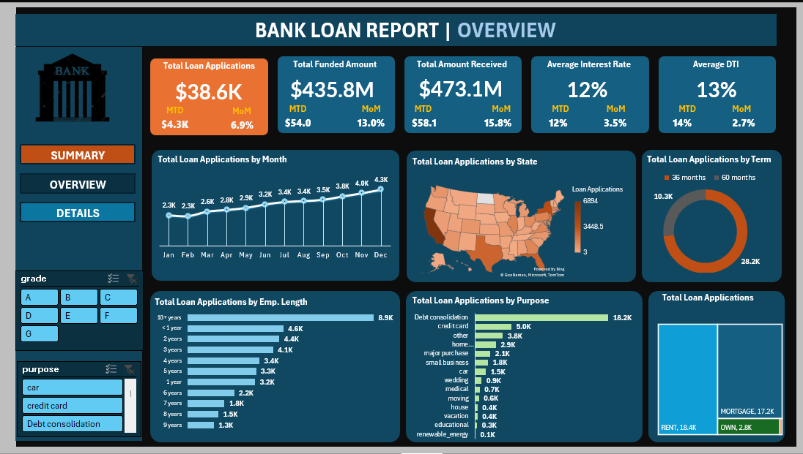

# Bank Loan Data Analysis – Excel Dashboard

## Overview
This project analyses a financial loan dataset using Microsoft Excel. The goal is to explore borrower and loan characteristics and present key insights in an interactive dashboard.

## Dataset
- Source: “provided dataset"
- Records: 38577
- Key fields: loan amount, interest rate, term, grade, purpose, income, DTI, loan status

## Tools & Techniques
- Data cleaning (missing values, formatting)
- Pivot tables & pivot charts
- Excel formulas (IF, XLOOKUP, SUMIFS)
- Dashboard design (KPIs + filters/slicers)

## Key Questions Addressed
- How many loan applications have been received and how do they trend over time?
- What proportion of loans are good versus bad, and how do their funded amounts differ?
- How do interest rates and DTI vary by loan status?
- Which loan purposes and borrower characteristics drive the highest application volumes?
- How is loan activity distributed across states and employment lengths?

## Files
- `financial_loan_data_dashboard.xlsx` – Excel workbook with analysis + dashboard
- `Dashboard_Overview_Preview.png` – screenshot of the overview dashboard
- `Dashboard_Summary_Preview.png` – screenshot of the summary dashboard
- `financial_loan_dataset.csv`
